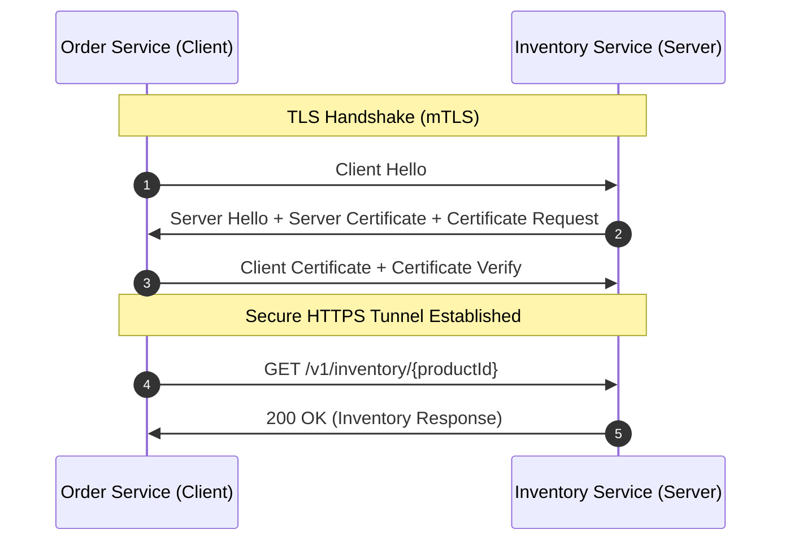

# Security Architecture: HTTPS & Mutual TLS (mTLS)

This document provides an overview of the security architecture, certificate configurations, local verification steps, and production recommendations for the `order-service` and `inventory-service` microservices.

---

## 1. Security Overview

To secure microservice communication, the system supports both **one-way SSL/TLS** (HTTPS) and **Mutual TLS** (mTLS) at the transport layer.



1. **One-Way TLS (HTTPS):** The client verifies the identity of the server to prevent eavesdropping and man-in-the-middle attacks.
2. **Mutual TLS (mTLS):** The server also verifies the identity of the client by requesting and validating the client's certificate. In our configuration, the server is set to `client-auth: need`, which strictly enforces mTLS.

---

## 2. Managing Certificates Locally

For local development and sandbox environments, we use a single self-signed keystore and truststore containing the certificate for `localhost` (with SAN `dns:localhost,ip:127.0.0.1`).

### The Automated Gradle Task

A Gradle task is configured in the root project to automate certificate generation and copy the certificates to both service resource subfolders.

To generate/regenerate certificates on the fly, run:
```bash
./gradlew generateCertificates
```

### Manual Generation Commands

If you prefer to run the generation steps manually, the underlying script executes the following `keytool` commands (included in the JDK):

```bash
# 1. Generate the PKCS12 Keystore containing the self-signed key pair
keytool -genkeypair \
  -alias wiremock-demo \
  -keyalg RSA \
  -keysize 2048 \
  -storetype PKCS12 \
  -keystore order-service/src/main/resources/certificates/keystore.p12 \
  -storepass changeit \
  -keypass changeit \
  -dname "CN=localhost, OU=Test, O=MinicDesign, L=Melbourne, ST=VIC, C=AU" \
  -validity 3650 \
  -ext "SAN=dns:localhost,ip:127.0.0.1" \
  -noprompt

# 2. Export the public certificate
keytool -exportcert \
  -alias wiremock-demo \
  -keystore order-service/src/main/resources/certificates/keystore.p12 \
  -storepass changeit \
  -file scripts/wiremock-demo.crt \
  -noprompt

# 3. Import the public certificate into the Truststore
keytool -importcert \
  -alias wiremock-demo \
  -keystore order-service/src/main/resources/certificates/truststore.p12 \
  -storepass changeit \
  -file scripts/wiremock-demo.crt \
  -noprompt

# 4. Sync files to the inventory-service certificates folder
cp order-service/src/main/resources/certificates/keystore.p12 inventory-service/src/main/resources/certificates/
cp order-service/src/main/resources/certificates/truststore.p12 inventory-service/src/main/resources/certificates/
```

---

## 3. Local Run & Verification

Security is disabled by default for developer convenience and can be toggled using the `feature.security-https-enabled` feature flag.

### Enabling HTTPS and mTLS

Run the services with the feature flag:
```bash
# Start Inventory Service (port 8081 over HTTPS/mTLS)
./gradlew :inventory-service:bootRun --args="--feature.security-https-enabled=true"

# Start Order Service (port 8082 over HTTPS/mTLS)
./gradlew :order-service:bootRun --args="--feature.security-https-enabled=true"
```

If you are using Wiremock, start it with the HTTPS parameter:
```bash
./gradlew startWiremockLocal -Pwiremock.https=true
```

### Verifying with Curl

Since the services are configured with `client-auth: need`, a simple HTTPS connection without a client certificate will fail.

* **Without Client Certificate (Fails):**
  ```bash
  curl -k https://localhost:8081/v1/inventory/PROD-001
  # Expected: Handshake failure / Peer closed connection
  ```

* **With Client Certificate (Succeeds):**
  Pass the PKCS12 keystore containing the client certificate and the password `changeit`:
  ```bash
  curl -k --cert-type P12 --cert order-service/src/main/resources/certificates/keystore.p12:changeit \
    https://localhost:8081/v1/inventory/PROD-001
  ```

---

## 4. Production Security Architecture (AWS)

In a production environment, self-signed certificates should not be checked into the repository or used in the running JVMs. 

### Public vs. Private Certificates

* **AWS Certificate Manager (ACM) Public Certificates:**
  ACM public certificates are **free** and auto-renewed, but the private key is managed by AWS and **cannot be downloaded**. These certificates can only be installed on AWS-managed resources like an **Application Load Balancer (ALB)**, **CloudFront**, or **API Gateway**.
* **AWS Private CA:**
  Allows issuing internal certificates that can be downloaded to EC2 or ECS/EKS containers. However, this is a paid service (costs ~$400/month per CA).

### Production Implementation Options

1. **Option A: SSL Termination at the Load Balancer (Standard)**
   * Deploy a free public ACM certificate on the ALB.
   * The client connects via HTTPS to the ALB.
   * The ALB terminates the SSL session and forwards the request over HTTP to the Spring Boot containers inside a private subnet.
2. **Option B: Mutual TLS via Service Mesh (Zero-Trust)**
   * Deploy your microservices on EKS (Kubernetes).
   * Install a service mesh like **Istio** or **Linkerd**.
   * The sidecar proxies (Envoy) handle mutual TLS, certificate generation, and rotation automatically at the network layer. 
   * This allows the Spring Boot application code to remain simple and run over plain HTTP locally, while traffic in the cluster is fully secure.
